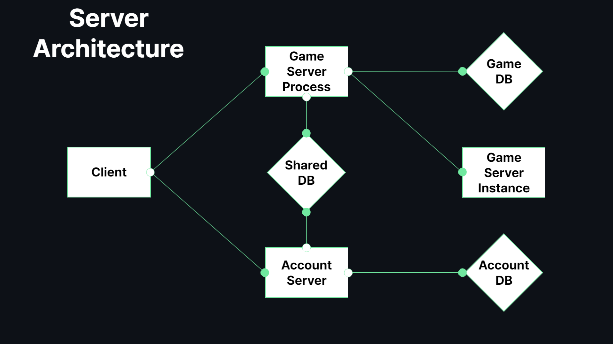

<h2>MMO RPG 프로젝트</h2>

MMO RPG 프로젝트는 Unity와 `TCP/IP 소켓`과 `HTTP`를 사용한 MMO RPG 입니다.

[실행 영상](https://youtu.be/rkpdzgeK8vM)

---

<h3>기술 스택</h3>

---

<table align="center">
    <tr align="center">
        <td style="font-weight: bold; padding-right: 10px; vertical-align: center;">
            언어
        </td>
        <td>
             
        </td>
    </tr>
        <tr align="center">
        <td style="font-weight: bold; padding-right: 10px; vertical-align: center;">
            게임 엔진
        </td>
        <td>
            
        </td>
    </tr>
        <tr align="center">
        <td style="font-weight: bold; padding-right: 10px; vertical-align: center;">
            데이터베이스
        </td>
        <td>
            
            
        </td>
    </tr >
        <tr align="center">
        <td style="font-weight: bold; padding-right: 10px; vertical-align: center;">
        라이브러리
        </td>
        <td>       
                                
        </td>
    </tr>
</table>

<h2>로그인</h2>

클라이언트에서 로그인 시도 시 `계정 서버(웹 서버)`로   
로그인 패킷을 HTTP를 사용하여 보냅니다.  
로그인 패킷을 받은 계정 서버에서는 패킷에 맞는 계정을  
`AccountDB`에서 찾고 성공 시 `SharedDB`에서 해당 계정 Id에 맞는 `토큰`을 갱신하고  
클라이언트에게 게임 서버 프로세스의 정보와 토큰의 정보를 넘깁니다.    
패킷을 받은 클라이언트에서 전달받은 `게임 서버 프로세스`로 연결하고  
연결 성공 시 게임 서버 프로세스에게 토큰 정보를 담은 로그인 패킷을 전송합니다.  
패킷을 받은 게임 서버 프로세스에서 SharedDB에서 전달받은 토큰이 유효한지 확인합니다.   
유효할 경우 GameDB에서 토큰의 계정 ID에 맞는 게임 계정ID를 찾고  
로그인을 시도한 클라이언트 세션을 시작하고 클라이언트에게 로그인 성공 패킷을 전송합니다.

---

<h2>아키텍쳐</h2>

MMO RPG 프로젝트의 서버 구조는  

계정의 관리를 담당하는 `계정 서버(웹 서버)`가 있습니다.  
계정 서버는 `HTTP`를 사용하여 클라이언트와 통신합니다.  

접속중인 유저의 관리를 담당하는 `게임 서버 프로세스`가 있습니다.  
게임 서버 프로세스는 `TCP/IP` 소켓을 사용하여 클라이언트와 통신합니다.  

게임의 로직을 담당하는 `게임 서버 인스턴스`가 있습니다.  
게임 서버 인스터스는 게임 서버 프로세스와 `TCP/IP 소켓을 사용한 IPC통신`을 통하여 통신합니다.  
또한 게임 서버 인스터스는 게임 서버 프로세스를 통해 클라이언트와 통신합니다.

유저의 계정 정보를 저장하는 `AccountDB`가 있습니다.

현재 접속할 수 있는 서버의 정보와 토큰을 저장하는 `SharedDB`가 있습니다.

유저의 게임 정보를 저장하는 `GameDB`가 있습니다.
