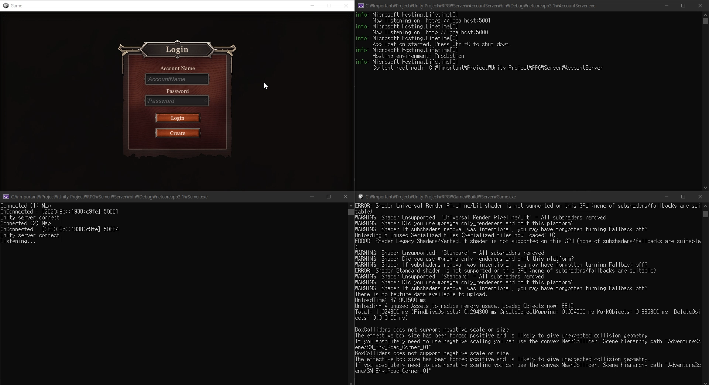

<h2>MMO RPG Project</h2>

MMO RPG project is Unity3D MMORPG with `Tcp/Ip socket` and `HTTP`

[Execution Video](https://youtu.be/rkpdzgeK8vM)

---

<h3>Languages and Tools</h3>

---

<table align="center">
    <tr align="center">
        <td style="font-weight: bold; padding-right: 10px; vertical-align: center;">
            Language
        </td>
        <td>
             
        </td>
    </tr>
        <tr align="center">
        <td style="font-weight: bold; padding-right: 10px; vertical-align: center;">
            Game Engine
        </td>
        <td>
            
        </td>
    </tr>
        <tr align="center">
        <td style="font-weight: bold; padding-right: 10px; vertical-align: center;">
            Database
        </td>
        <td>
            
            
        </td>
    </tr >
        <tr align="center">
        <td style="font-weight: bold; padding-right: 10px; vertical-align: center;">
        Library
        </td>
        <td>       
                                
        </td>
    </tr>
</table>

<h2>Login</h2>

When a client attempts to log in, 
it sends a login packet to the `Account Server (web server)` using HTTP.   
The Account Server then searches for the corresponding account in the AccountDB and,   
upon success, updates the token for the account ID in the `SharedDB`.    
It then sends the client information about the `Game Server Process` and the token.   
The client, upon receiving this packet, connects to the Game Server Process and,   
upon successful connection, sends a login packet containing the token information to the server.   
The Game Server Process checks if the token received from the SharedDB is valid.   
If valid, it finds the game account ID corresponding to the token's account ID in the `GameDB`,   
starts the client session, and sends a login success packet to the client.

---

<h2>Architecture</h2>

The MMO RPG project features a server structure that includes:  

`Account Server` (web server), which is responsible for managing user accounts.   
This server communicates with clients using `HTTP`.  

`Game Server Process`, tasked with managing connected players.   
It communicates with clients via `TCP/IP sockets`.

`Game Server Instance`, which handles the game logic.   
It communicates with the Game Server Process through `IPC communication using TCP/IP sockets`   
and also facilitates communication with clients via the Game Server Process.

`AccountDB`, stores user account information.

`SharedDB`, stores information about currently available servers and tokens.

`GameDB`, stores the user's game data