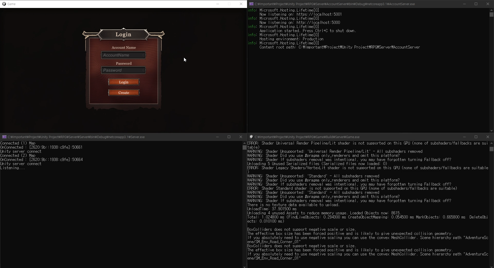
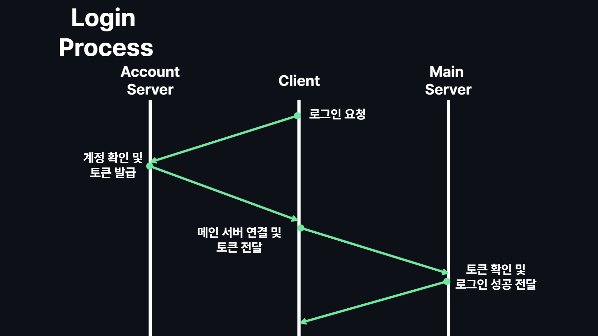
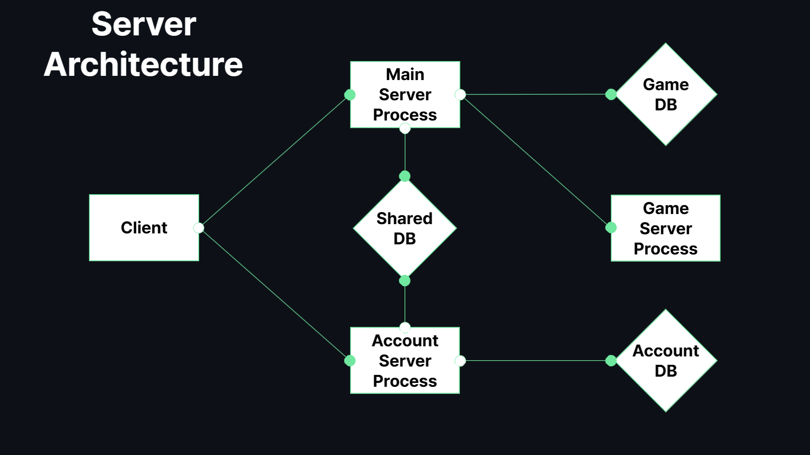

<h2>MMO RPG 프로젝트</h2>

MMO RPG 프로젝트는 Unity와 `TCP/IP 소켓`과 `HTTP`를 사용한 MMO RPG 입니다.

[실행 영상](https://www.youtube.com/watch?v=Cpboz2mf5Pk&t=109s)

---

<h3>기술 스택</h3>

---

<table align="center">
    <tr align="center">
        <td style="font-weight: bold; padding-right: 10px; vertical-align: center;">
            언어
        </td>
        <td>
             
        </td>
    </tr>
        <tr align="center">
        <td style="font-weight: bold; padding-right: 10px; vertical-align: center;">
            게임 엔진
        </td>
        <td>
            
        </td>
    </tr>
        <tr align="center">
        <td style="font-weight: bold; padding-right: 10px; vertical-align: center;">
            데이터베이스
        </td>
        <td>
            
            
        </td>
    </tr >
        <tr align="center">
        <td style="font-weight: bold; padding-right: 10px; vertical-align: center;">
        라이브러리
        </td>
        <td>       
                                
        </td>
    </tr>
</table>

<h2>로그인</h2>

1. 클라이언트에서 ID와 비밀번호를 담아 
계정 서버로 로그인 요청합니다.  

2. 계정 서버에서 요청이 올바른지 확인하고
SharedDB에 토큰을 생성한 후 
토큰을 클라이언트로 넘깁니다.

3. 계정 서버의 응답을 받은 
클라이언트에서 메인 서버로 연결하고
메인 서버로 응답에 담긴 토큰을 전달합니다.

4. 메인 서버에서 SharedDB를 통해 
토큰이 올바른지 확인하고 클라이언트에게
로그인 성공 패킷을 전달합니다. 

---

<h2>아키텍쳐</h2>

MMO RPG 프로젝트의 서버 구조는 멀티 프로세스 구조로  

계정의 관리를 담당하는 `계정 서버 프로세스(웹 서버)`가 있습니다.  
계정 서버 프로세스는 `HTTP`를 사용하여 클라이언트와 통신합니다.  

접속중인 유저의 관리를 담당하는 `메인 서버 프로세스`가 있습니다.  
메인 서버 프로세스는 `TCP/IP` 소켓을 사용하여 클라이언트와 비동기 통신을 합니다.  

게임의 로직을 담당하는 `게임 서버 프로세스(유니티 데디케이트 서버)`가 있습니다.  
게임 서버 프로세스는 메인 서버 프로세스와 `TCP/IP 소켓을 사용한 IPC통신`을 통하여 통신합니다.  
또한 게임 서버 프로세스는 `메인 서버 프로세스를 통해 클라이언트와 간접적으로 통신`합니다.

유저의 계정 정보를 저장하는 `AccountDB`가 있습니다.

현재 접속할 수 있는 서버의 정보와 토큰을 저장하는 `SharedDB`가 있습니다.

유저의 게임 정보를 저장하는 `GameDB`가 있습니다.
